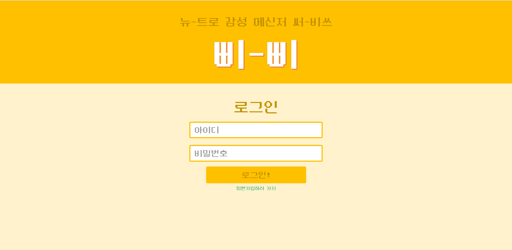
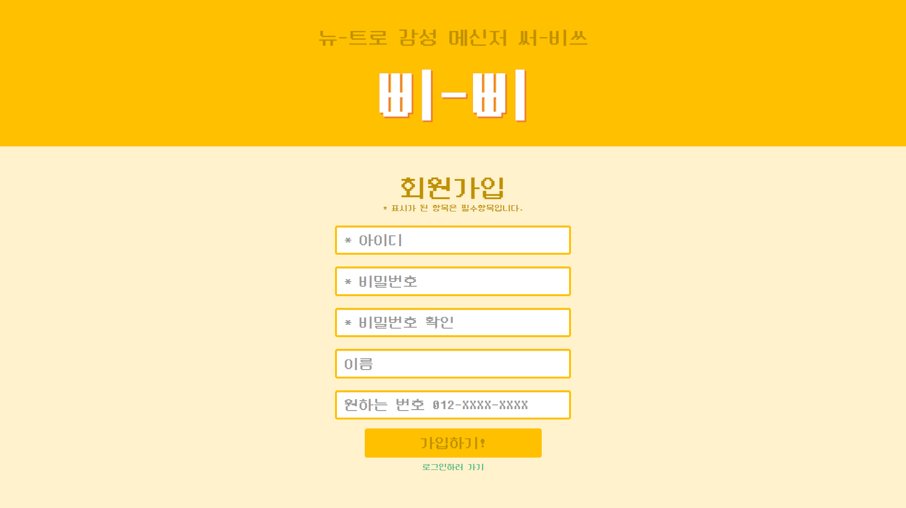
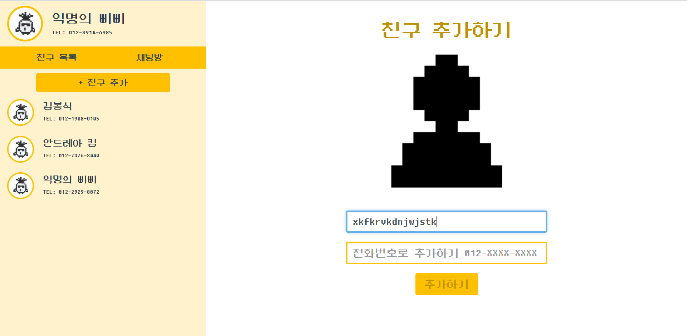
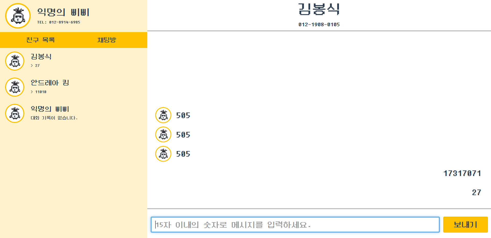

# BBIBBI

## About
2020 봄 SPARCS 신입생 프로젝트로 제작한 레트로 메신저 웹서비스, 삐삐입니다.

## Used
* Vue.js frontend
* Nodejs server
* MySQL DB

## Features
### 1. Main page

로그인 페이지입니다. ID와 비밀번호를 입력해 로그인할 수 있고, 아래의 '회원가입하러 가기'를 눌러 회원가입 페이지로 이동할 수도 있습니다.

로그인 인증은 JWT를 이용하여 이루어집니다.

### 2. Signup page

회원가입 페이지입니다. 아이디와 비밀번호를 필수로 입력해야 하고, 이름과 원하는 전화번호를 추가로 지정할 수 있습니다. 이름을 입력하지 않는 경우 '익명의 삐삐'로 세팅되며, 번호를 입력하지 않는 경우 랜덤하게 전화번호가 설정됩니다.

### 3. Add friends

아이디 또는 전화번호를 이용해 친구를 추가할 수 있습니다. 추가된 친구는 왼쪽 리스트에 표시됩니다.

### 4. Chat

친구를 클릭하면 채팅방에 입장하게 됩니다. 90년대 통신기기 '삐삐'를 모티브로 한 만큼, 20자 이내의 숫자열로 이루어진 메시지만 전송이 가능합니다.

## Project setup
```
npm install
```

### Compiles and hot-reloads for development
```
npm run serve
```

### Compiles and minifies for production
```
npm run build
```

### Lints and fixes files
```
npm run lint
```

### Customize configuration
See [Configuration Reference](https://cli.vuejs.org/config/).
